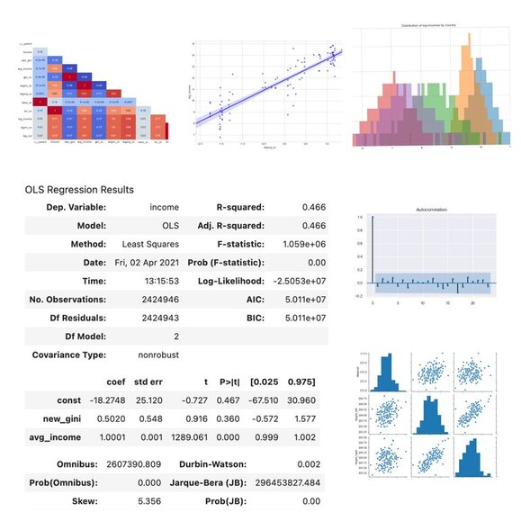
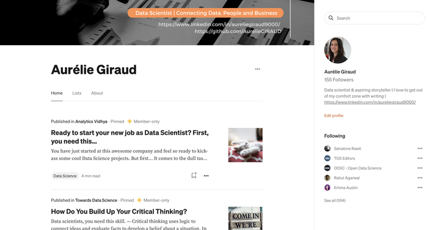

## Portfolio

---

### Machine Learning Applications

#### Regressions Models

- **Logistic Regression**: [Fraud detection on banknotes](/logistic_regression)
    
- **ANOVA**: [Targeting future customers from a bank portfolio](/anova_multiple_linear)
    
- **Multiple Linear Regression**: [Optimizing marketing budget based on sales revenues](/linear_regression)
    
 
 

#### Clustering

- **K-Means, SpectralClustering, AgglomerativeClustering, DBSCAN and K-Medoid:** [Customer Segmentation based on credit card data](https://github.com/AurelieGIRAUD/Data_Science_Projects/tree/main/Clustering)

---

### Blogs & Articles

- [Mastering the evaluation of classification models with storytelling](https://towardsdatascience.com/mastering-the-evaluation-of-classification-models-with-storytelling-f8a9f63f3723?sk=2dd4c64b716928ab3379686a058a5b03)
- [How to run an Exploratory Data Analysis — step by step?](https://medium.com/analytics-vidhya/step-by-step-run-exploratory-data-analysis-340f2bd02905?sk=70337803007d2f3db6124a0036f8446d)
- [How Do You Build Up Your Critical Thinking?](https://towardsdatascience.com/data-scientists-you-need-that-skill-how-to-build-critical-thinking-9891c833eacd?sk=fec976e0ed50fa9149669e8b5f7898e7)
- [Ready to start your new job as Data Scientist? First, you need this…](https://medium.com/analytics-vidhya/starter-kit-for-data-scientist-80102fdaff65?sk=55438bd50099613bf0f5b021687d366a)
- [Kick Start for PySpark — Which functions to use for data analysis?](https://medium.com/analytics-vidhya/kick-start-for-pyspark-ca59b1ef5e6a?sk=03e81e8bf3e45a69b0d523ebf3b67efb)
- [How to check the main assumptions supporting linear regression models?](https://towardsdatascience.com/perform-regression-diagnostics-and-tackle-uncertainties-of-linear-models-1372a03b1f56?sk=58a2cdad4619ba03582168634f931b3c)
- [How to build a powerful business index?](https://towardsdatascience.com/how-to-build-an-index-452f5018d5aa?sk=a99d12913cbc00f8451b44f13bb6d181)
- [Random Forest: what you need to know before starting](https://towardsdatascience.com/quick-intro-to-random-forest-3cb5006868d8?sk=9d1a49e3f5f1ad350f425344c0f5c335)
    
 

