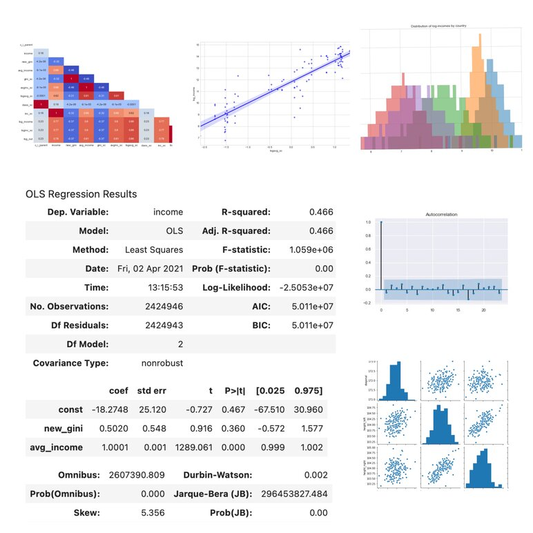

## Portfolio

---

### Machine Learning Applications

#### Regressions Models

- **Logistic Regression**: [Fraud detection on banknotes](/logistic_regression)
    
- **ANOVA**: [Targeting future customers from a bank portfolio](/anova_multiple_linear)
    
- **Multiple Linear Regression**: [Optimizing marketing budget based on sales revenues](/linear_regression)
    
 
 

---

#### Clustering

- **K-Means, SpectralClustering, AgglomerativeClustering, DBSCAN and K-Medoid:** [Customer Segmentation with Clustering Algorithm](https://github.com/AurelieGIRAUD/Data_Science_Projects/tree/main/Clustering)

---

