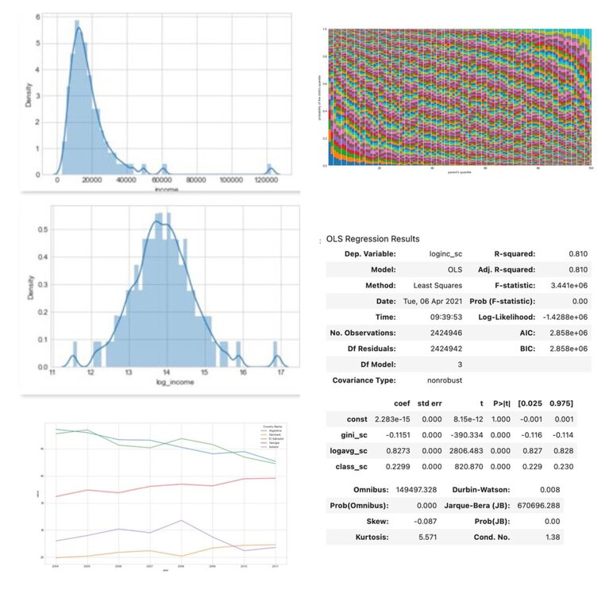

## Portfolio

---

### Machine Learning Applications

#### Regressions Models

- **Logistic Regression**: [Fraud Detection](/logistic_regression)
    

- **ANOVA**: [Targeting new customers based on revenue prediction](/anova_multiple_linear)
    

- **Multiple Linear Regression**: [Optimize marketing budget based on sales revenues](/linear_regression)
    

---

#### Clustering

[Customer Segmentation with Clustering Algorithm](https://github.com/AurelieGIRAUD/Data_Science_Projects/tree/main/Clustering)

---

