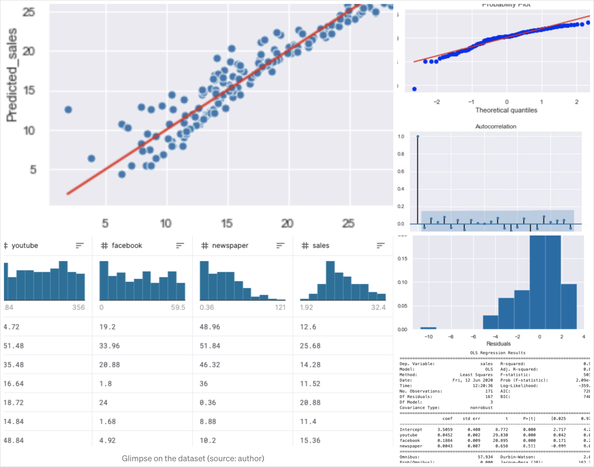

## Portfolio

---

### Machine Learning Applications

[Fraud Detection with Logistic Regression Model](https://github.com/AurelieGIRAUD/Data_Science_Projects/tree/main/Logistic_Regression)

---
[Customer Segmentation with Clustering Algorithm](https://github.com/AurelieGIRAUD/Data_Science_Projects/tree/main/Clustering)

---
[Revenue Prediction with ANOVA](https://github.com/AurelieGIRAUD/Data_Science_Projects/tree/main/ANOVA)

---
---
[Predict Marketing Sales with Multiple Linear Regression](https://github.com/AurelieGIRAUD/Data_Science_Projects/blob/main/Linear_Regression/Application_Linear_Model.ipynb)
    

### Category Name 2

- [Project 1 Title](http://example.com/)
- [Project 2 Title](http://example.com/)
- [Project 3 Title](http://example.com/)
- [Project 4 Title](http://example.com/)
- [Project 5 Title](http://example.com/)

---

---

Page template forked from <a href="https://github.com/evanca/quick-portfolio">evanca</a>

<!-- Remove above link if you don't want to attibute -->
