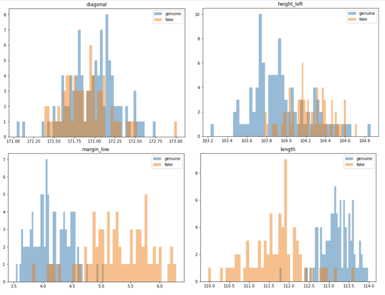
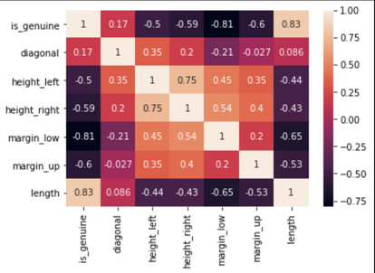
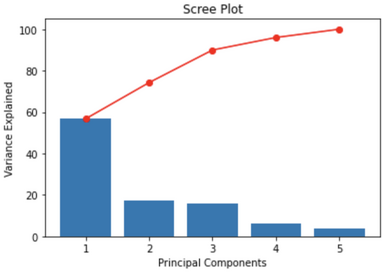
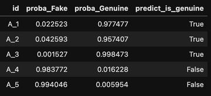

# Detect counterfeit banknotes with logistic regression

### ✅ Business Case

In this project, we create a model to detect fake banknotes using labelled data containing the characteristics of genuine and fake banknotes and a Logistic Regression model.


### 📉 Dataset

This project was completed as a part of the [Data Analyst nanodegree](https://openclassrooms.com/en/dashboard/paths) displayed by Openclassrooms. 
The dataset is therefore provided by the platform as a part of the program.

### 📒 Repository
The repository is available on [GitHub](https://github.com/AurelieGIRAUD/Data_Science_Projects/tree/main/Logistic_Regression). It describes how to apply a Logistic Regression Model using the following steps:

1. Exploratory Data Analysis (EDA)
  
  - Univariate and Bivariate Analysis. 
  - Handling outliers.
  - Data Visualizations supported by MatplotLib.
  
 2. Principal Component Analysis (PCA)
  
  - Scree Plot Analysis.
  - Loadings Plots.
  - Scores Plots.
  - Selection of the principal components.
  
 3. Logistic Regression
  
  - Train and Apply a logistic regression model to detect fake banknotes using their dimensions.
  - Performances Analysis.


### 🎯 Key take-away

1. Selection of the explanatory variables

We use the univariate analysis to spot the most relevant variables to discriminate the banknotes.



✅ We can see on the plots above that the distribution for margin and length looks slightly different whether or not, the banknote is genuine. Which mean that this variables are useful to detect the fraud. Whereas the distributions of the variables height and diagonal for the fake and genuine banknotes are overlapping - meaning that these parameters are not relevant for the model.

We can complete the selection with a correlation analysis to detect the variables the most highly correlated to the label - and by extension, remove the ones not correlated.



✅ We can see for example, that the coefficient of correlation between the feature diagonal and the label column "is_genuine" is very low. It indicates that the variable diagonal is not relevant to find out if a banknote is genuine or not.

2. Handling the outliers

The distributions are skewed which may indicate the presence of outliers. This point is confirm by using box-plots.
Often, machine learning modeling can be improved by understanding, handling or removing the outlier values.

One method for removing the outliers when the data are following a Gaussian-like distribution, consist of using a threshold = 3 Standard Deviation. A value that falls outside of 3 standard deviations from the mean is part of the distribution, but it is an unlikely or rare event. This is a common cut-off in practice for identifying outliers in a Gaussian or Gaussian-like distribution. For smaller samples of data, perhaps a value of 2 standard deviations (95%) can be used, and for larger samples, perhaps a value of 4 standard deviations (99.9%) can be used.
Another method if the data are not normal or not normal enough to treat it as being drawn from a Gaussian distribution, consist of using the InterQuartile Range (IQR). The IQR is calculated as the difference between the 75th and the 25th percentiles of the data and defines the box in a box and whisker plot. The IQR can be used to identify outliers by defining limits on the sample values that are a factor k of the IQR below the 25th percentile or above the 75th percentile. The common value for the factor k is the value 1.5. A factor k of 3 or more can be used to identify values that are extreme outliers or “far outs” when described in the context of box and whisker plots [source](https://machinelearningmastery.com/how-to-use-statistics-to-identify-outliers-in-data/).

```python
# Return a dataframe containing the outliers based on the quantile method
def get_outliers(df):
    Q1 = df.quantile(0.25)
    Q3 = df.quantile(0.75)
    IQR = Q3 - Q1
    df_out = df[((df < (Q1 - 1.5 * IQR)) |(df > (Q3 + 1.5 * IQR))).any(axis=1)] 
    
    return df_out
   ```

✅ Having outliers on the fake banknotes is something we could expect as by definition these banknotes are not genuine so not standardized. To the contrary, having outliers on the genuine banknotes is not normal. Banknotes are supposed to follow a rigourous standard in terms of dimensions. They could be due to a measurement error or a data entry error. Considering this, we suggest to keep the outliers on the fake set and remove them from the genuine set. 

3. Dimensionality Reduction

In the Exploratory Data Analysis (EDA), we have seen that some features might be correlated to one another. A robust model is a simple model, which means that we want to keep only the necessary information by removing redundancy. For that purpose, we will perform a principal component analysis (PCA) to reduce the dimension of the features. The main idea behind PCA is that most of the variance hold in high-dimensional data can be captured in a lower-dimensional subset composed by few principal components. Reducing the dimension is therefore based on choosing the right number of principal components to retain.

A scree plot displays how much variance each principal components (PCs) captures from the data. It is a good visualization to check wether or not the PCA worked well. Ideally, the 1st component will capture the most variance, then the second one, and so on. The y axis is eigenvalues, which essentially stand for the amount of variance explained.



✅ The first two components capture about 74% of the variance which is pretty low. To select the number of PC to keep, in that case, we could use these rules of thumbs:

- Pick PCs with eigenvalues of at least 10%.
- The selected PCs should be able to describe at least 82% of the variance.
- Based on the scree plot, we decide to keep the first 3 components as they capture about 90% of the variance which is good.

[blog.bioturing.com/](https://blog.bioturing.com/2018/06/18/how-to-read-pca-biplots-and-scree-plots/)


[stats.stackexchange](https://stats.stackexchange.com/questions/223450/t-sne-versus-mds)

We need to keep the first 3 PCs to hit 90% of the variance explained on the dataset.

4. Classification

We have selected our 3 principal components, we can now move on to the next and final part, which consists of creating a predictive model to detect the fake banknotes. The problem we want to solve is a binary classification and the dataset is labelled so this is a supervised problem. The size of the dataset is relatively small and the main focus is to be accurate (Remember: we want to detect fake banknotes). Therefore, Logistic Regression is especially indicated for this case-study.


```python
# Create a function to wrap all the steps required to detect the fake banknotes

def fake_detector(dataset,idxcol):
    
    # Read the data
    df = pd.read_csv(Path.cwd()/dataset)
    
    # Deselect non relevant features
    df.drop('diagonal', inplace=True, axis=1) 

    # Standardization
    mask = df.columns
    df[mask] = StandardScaler().fit_transform(df[mask])
    
    # Extract features
    features = df.columns
    
    # Reduce dimension with PCA
    pca = PCA()
    name = ['PC1','PC2','PC3','PC4','PC5']
    df_PCA = df.reset_index()[['id']]
    df_PCA[name] = pd.DataFrame(pca.fit_transform(df.values),columns=[name])
    
    # Keep only the first 3 PCs
    results = df_PCA.iloc[:,0:4].copy()
    
    # Predict
    results['proba_Fake'] = lgr2.predict_proba(df_PCA.iloc[:,1:4])[:,0]
    results['proba_Genuine'] = lgr2.predict_proba(df_PCA.iloc[:,1:4])[:,1]
    results['predict_is_genuine'] = lgr2.predict(df_PCA.iloc[:,1:4])
    
    return results[['id','proba_Fake','proba_Genuine','predict_is_genuine']]
```



✅ We have created a logistic regression model that calculate the probability of a banknote to be fake or genuine and generate a prediction.
The next step, that hasn't been developed into this project, would be to evaluate the performances of the model. 
