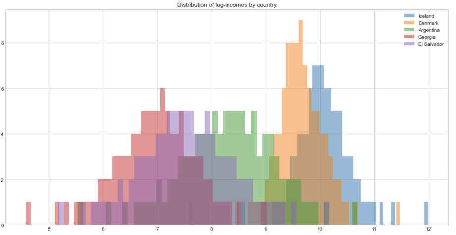
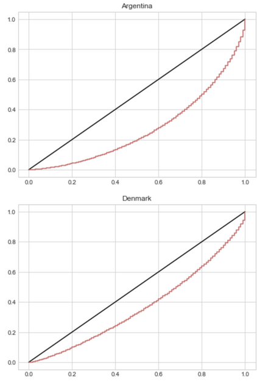
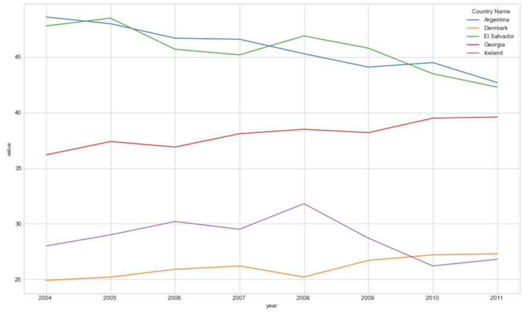

# Detect counterfeit banknotes with logistic regression

### ✅ Business Case

In this project, we are creating a model to detect fake banknotes using a Logistic Regression algorithm and labelled data containing the characteristics of genuine banknotes. 


### 📉 Dataset

This project was completed as a part of the [Data Analyst nanodegree](https://openclassrooms.com/en/dashboard/paths) displayed by Openclassrooms. 
The dataset is therefore provided by the platform as a part of the program.

### 📒 Repository
The repository is available on [GitHub](https://github.com/AurelieGIRAUD/Data_Science_Projects/tree/main/Logistic_Regression). It describes how to apply a Logistic Regression Model using the following steps:

1. Exploratory Data Analysis (EDA)
  
  - Univariate and Bivariate Analysis. 
  - Handling outliers
  - Data Visualizations supported by MatplotLib.
  
 2. Principal Component Analysis (PCA)
  
  - Scree Plot Analysis.
  - Loadings Plots.
  - Scores Plots.
  - Selection of the principal components.
  
 3. Logistic Regression
  
  - Train and Apply a logistic regression model to detect fake banknotes using their dimensions.
  - Performances Analysis.


### 🎯 Key take-away

We start the analytic by evaluating the diversity of income across a selection of 5 countries, using the Lorenz curve and Gini Index. The following distribution highlight the broad range of incomes among the selection:



1. Lorenz curve

The Lorenz concentration curve is a way to represent the distribution function of a variable X. It is used in particular in economics to measure inequalities in the possession of wealth. We will use it here to assess inequalities in terms of the distribution of incomes among the group of countries selected.

```python
def lorenz_curve(X):
    lorenz = np.cumsum(np.sort(X['income'])) / X['income'].sum()
    lorenz = np.append([0],lorenz) 
``` 



✅ The furthest the Lorenz curve is from the first bisector line, the more inequalities of revenue in the given country. We can see here that there are more inequalities in Argentina than in Denmark.

3. Gini Index

The Gini index represents the area between the Lorenz curve and the first bisector line. It is a good metric to summarize the information from the Lorenz curve.




✅ The smallest the Gini Index, the least inequalities in the given country. 
In our example, we can see that Denmark and Iceland are the countries with the least inequalities in our given selection. 
  

  
