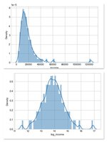
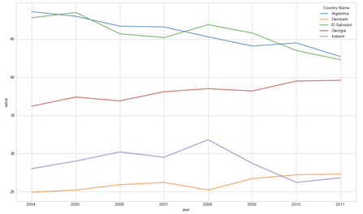
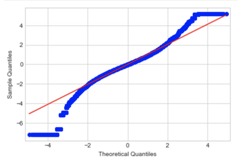

# Detect counterfeit banknotes with logistic regression

### ✅ Business Case

In this project, we are creating a model to detect fake banknotes using a Logistic Regression algorithm and labelled data containing the characteristics of genuine banknotes. 


### 📉 Dataset

This project was completed as a part of the [Data Analyst nanodegree](https://openclassrooms.com/en/dashboard/paths) displayed by Openclassrooms. 
The dataset is therefore provided by the platform as a part of the program.

### 📒 Repository
The repository is available on [GitHub](https://github.com/AurelieGIRAUD/Data_Science_Projects/tree/main/Logistic_Regression). It describes how to apply a Logistic Regression Model using the following steps:

1. Exploratory Data Analysis (EDA)
  
  - Univariate and Bivariate Analysis. 
  - Handling outliers
  - Data Visualizations supported by MatplotLib.
  
 2. Principal Component Analysis (PCA)
  
  - Scree Plot Analysis.
  - Loadings Plots.
  - Scores Plots.
  - Selection of the principal components.
  
 3. Logistic Regression
  
  - Train and Apply a logistic regression model to detect fake banknotes using their dimensions.
  - Performances Analysis.


### 🎯 Key take-away

#### 1. Explanatory Variables

**We start the analytics by evaluating the diversity of income across a selection of 5 countries, using the Lorenz curve and Gini Index.** 

1. Income 

Before to start we need to perform a log-transformation of the variable income because the distribution highly skewed to the right - meaning that there are some very high incomes. The transformation allows the distribution to follow a bell shape a.k.a Gaussian-like distribution.

✅ Here is an example of the effect of the log-transformation on the distribution of income for a given country.



2. Lorenz curve & Gini Index

The Lorenz concentration curve is a way to represent the distribution function of a variable X. It is used in particular in economics to measure inequalities in the possession of wealth. We will use it here to assess inequalities in terms of the distribution of incomes among the group of countries selected. The furthest the Lorenz curve is from the first bisector line, the more inequalities of revenue in the given country.


```python
def lorenz_curve(X):
    lorenz = np.cumsum(np.sort(X['income'])) / X['income'].sum()
    lorenz = np.append([0],lorenz) 
``` 


✅ In the example above, we can see here that there are more inequalities in Argentina than in Denmark.


The Gini index represents the area between the Lorenz curve and the first bisector line. It is a good metric to summarize the information from the Lorenz curve. The smallest the Gini Index, the least inequalities in the given country. 





✅ In the example above, we can see that Denmark and Iceland are the countries with the least inequalities in our given selection. 


3. Conditionnal probabilities

At that stage, we have two of the three desired explanatory variables: the average income and the gini index for each given country. 
We only lack now the income class of an individual's parents to move forward into the prediction. The idea is to use this variable to predict the probability for an individual to fall into the same class of income than its parents - this will bring us closer to predict the revenue of an individual.

We suppose here that we associate with each individual a unique class regardless of the number of parents. We are going to simulate this information using a coefficient (specific to each country) measuring a correlation between the income of an individual and the income of its parents. This coefficient will be called the elasticity coefficient or relative IGM in income. It measures the intergenerational income mobility.

✅ Here is an example of visualization for the country of Panama: the chart represents the conditionnal probability for a child to fall into the income class of its parents. We can see in that case, that the earnings of (adult) children are dependent on the income of their parents. It means, that a child born in a family with low revenue in Panama, has a higher probability to also have low revenue when he will be adult.


#### 2. Model 1: ANOVA

ANOVA is applied in this project to verify the effect of a qualitative variable (country's name) on a quantitative variable (income). 
There are certain assumptions that needs to be verified for ANOVA model:

**1. NORMALITY**

The assumption of normality is tested on the residuals of the model. It can be verified using histograms and Q-Q plot, or using statistical tests such as Shapiro-Wilk or Anderson & Darling. The violations of normality, continuing with ANOVA is generally ok if you have a large sample size.




✅ Q-Q plot: The distribution is relatively close to a normal distribution but has some fat tails to the right and left and is slightly in S shape. 

Because we have a sample size > 5000, the Shapiro test is actually not ideal (For N > 5000 the W test statistic is accurate but the p-value may not be). We can use the Anderson and Darling test or the non-parametric test Kolmogoriv and Smirnov.

_Anderson & Darling Hypothesis:_

_H0 = The sample is drawn from a population that follows a particular distribution, here the Normal distribution._
_H1 = The sample is NOT drawn from a population that follows the Normal distribution._
_If the returned statistic is larger than these critical values then for the corresponding significance level, the null hypothesis that the data come from the chosen distribution can be rejected._

```python
st.anderson(model2.resid,dist='norm')
```

```AndersonResult(statistic=10248.77901675459, critical_values=array([0.576, 0.656, 0.787, 0.918, 1.092]), significance_level=array([15. , 10. ,  5. ,  2.5,  1. ]))```

✅ The statistic value is largely above any of the critical values, meaning that we are in the zone where H0 can be rejected. The residuals are not following a Normal distribution. 


**2. HOMOGENEITY of variance**

The assumption of homogeneity of variance is an assumption of the independent samples t-test and ANOVA stating that all comparison groups have the same variance. The independent samples t-test and ANOVA utilize the t and F statistics respectively, which are generally robust to violations of the assumption as long as group sizes are equal. Equal group sizes may be defined by the ratio of the largest to smallest group being less than 1.5 [source](https://www.statisticssolutions.com/the-assumption-of-homogeneity-of-variance/)

One method for testing this assumption is the Levene's test of homogeneity of variances. If the data is not following a normal distribution Levene’s test is preferred over the Barlett’s test.

```python
# Test homoscedasticity by comparing the group (= countries) with dependent variable = log_income
pg.homoscedasticity(df, dv='log_income', group='name',method='levene')
```

✅ The test revealed that the condition of homogeneity of variances is not respected.
Numerous investigations have examined the effects of variance heterogeneity on the empirical probability of a Type I error for the analysis of variance (ANOVA) F-test and the prevailing conclusion has been that when sample sizes are equal, the ANOVA is robust to variance heterogeneity. However, we should not assumed that the ANOVA F-test is always robust to variance heterogeneity when sample sizes are equal [source](https://doi.org/10.2307/1162346)
In this case study, we do not have strictly the same size for each groups however the differences are very small (<< 1,5 between the largest and the smallest group), so we might consider our model robust to the violation of this assumption. Alternatively, there are two tests that we could run that are applicable when the assumption of homogeneity of variances has been violated: (1) Welch or (2) Brown and Forsythe test.

**3. INDEPENDENCE**

Independence of residual is commonly referred to as the total absence of autocorrelation. Even though uncorrelated data does not necessarily imply independence, one can check if random variables are independent if their mutual information tends to 0. We can use a Durbin and Watson test which calculates the Durbin-Watson statistic. The test will output values between 0 and 4. Here are how to interpret the results of the test:

_- The closer to 2, the more evidence for no autocorrelation._
_- The closer to 0 the statistic, the more evidence for positive serial correlation._
_- The closer to 4, the more evidence for negative serial correlation._

```python
df.durbin_watson(model2bis.resid, axis=0)
```

``` python 
>> Output: 0.0004796685172174014
```

✅ The result suggest a positive autocorrelation in the residuals. So the condition of independance is not verified.

💥 All in all, none of the conditions necessary for applying an ANOVA are verified here. So, even tough the model retrieved some relatively good performances we can not rely on it.
Let's try to build another model based on multiple linear regression.


#### 3. Model 2: Multiple Linear Regression

The model based on the gini index, the log-average income and the parent's class, is the one providing the best performances to predict the income: it explains 81% of the variances, meaning that only 19% remains unexplained and due to others factors ike fx. chance, efforts,...


  

  
