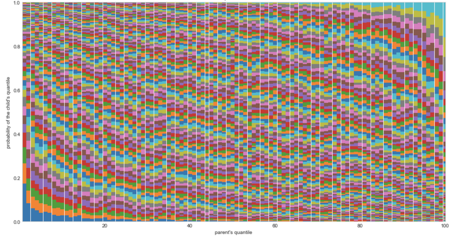

# Detect counterfeit banknotes with logistic regression

### ✅ Business Case

In this project, we are creating a model to detect fake banknotes using a Logistic Regression algorithm and labelled data containing the characteristics of genuine banknotes. 


### 📉 Dataset

This project was completed as a part of the [Data Analyst nanodegree](https://openclassrooms.com/en/dashboard/paths) displayed by Openclassrooms. 
The dataset is therefore provided by the platform as a part of the program.

### 📒 Repository
The repository is available on [GitHub](https://github.com/AurelieGIRAUD/Data_Science_Projects/tree/main/Logistic_Regression). It describes how to apply a Logistic Regression Model using the following steps:

1. Exploratory Data Analysis (EDA)
  
  - Univariate and Bivariate Analysis. 
  - Handling outliers
  - Data Visualizations supported by MatplotLib.
  
 2. Principal Component Analysis (PCA)
  
  - Scree Plot Analysis.
  - Loadings Plots.
  - Scores Plots.
  - Selection of the principal components.
  
 3. Logistic Regression
  
  - Train and Apply a logistic regression model to detect fake banknotes using their dimensions.
  - Performances Analysis.


### 🎯 Key take-away

#### Explanatory Variables

**We start the analytic by evaluating the diversity of income across a selection of 5 countries, using the Lorenz curve and Gini Index.** 


✅ The following distribution highlight the broad range of incomes among the selection: the average income move from left to right (from low to high) depending on the country. Georgia and El Salvador are the 2 countries with the lowest average income in the given selection.


1. Lorenz curve

The Lorenz concentration curve is a way to represent the distribution function of a variable X. It is used in particular in economics to measure inequalities in the possession of wealth. We will use it here to assess inequalities in terms of the distribution of incomes among the group of countries selected. The furthest the Lorenz curve is from the first bisector line, the more inequalities of revenue in the given country.


```python
def lorenz_curve(X):
    lorenz = np.cumsum(np.sort(X['income'])) / X['income'].sum()
    lorenz = np.append([0],lorenz) 
``` 


✅ In the example above, we can see here that there are more inequalities in Argentina than in Denmark.

2. Gini Index

The Gini index represents the area between the Lorenz curve and the first bisector line. It is a good metric to summarize the information from the Lorenz curve. The smallest the Gini Index, the least inequalities in the given country. 


✅ In the example above, we can see that Denmark and Iceland are the countries with the least inequalities in our given selection. 


3. Conditionnal probabilities

At that stage, we have two of the three desired explanatory variables: the average income and the gini index for each given country. 
We only lack now the income class of an individual's parents to move forward into the prediction. The idea is to use this variable to predict the probability for an individual to fall into the same class of income than its parents - this will bring us closer to predict the revenue of an individual.

We suppose here that we associate with each individual a unique class regardless of the number of parents. We are going to simulate this information using a coefficient (specific to each country) measuring a correlation between the income of an individual and the income of its parents. This coefficient will be called the elasticity coefficient or relative IGM in income. It measures the intergenerational income mobility.

✅ Here is an example of visualization for the country of Panama: the chart represents the conditionnal probability for a child to fall into the income class of its parents. We can see in that case, that the earnings of (adult) children are dependent on the income of their parents. It means, that a child born in a family with low revenue in Panama, has a higher probability to also have low revenue when he will be adult.




#### ANOVA

ANOVA is applied in this project to verify the effect of a qualitative variable (country's name) on a quantitative variable (income).
Before to start we need to perform a log-transformation of the variable income because the distribution highly skewed to the right - meaning that there are some very high incomes. The transformation allows the distribution to follow a bell shape a.k.a Gaussian-like distribution.

✅ Here is an example of the effect of the log-transformation on the distribution of income for a given country.


There are certain assumptions we need to verify before to be able to apply the ANOVA:

1. NORMALITY - The assumption of normality is tested on the residuals of the model. It can be verified using histograms and Q-Q plot, or using statistical tests such as Shapiro-Wilk. The violations of normality, continuing with ANOVA is generally ok if you have a large sample size.

2. HOMOGENEITY of variance - Homogeneity means that the variance among the groups should be approximately equal. It can be tested using tests such as Levene’s test or the Brown-Forsythe Test. In general, with violations of homogeneity, the analysis is considered robust if you have equal-sized groups.

3. INDEPENDENCE - The sample cases should be independent of each other.The observations are obtained independently and randomly from the population defined by the factor levels. It can be verified with ACF (autocorrelation function) plots and Durbin-Watson test. ANOVA is not robust to violations to the assumption of independence.


#### Multiple Linear Regression

The last linear model, based on the gini index, the log-average income and the parent's class, is the one providing the best performances to predict the income (log transformed): it explains 81% of the variances, meaning that only 19% remains unexplained and due to others factors ike fx. chance, efforts,...
In this last model, we can also notice that the coefficient associated to the gini index is negative.

R-squared is relatively good (about 70%) in this model. Adding the parent's class improve the global performances of the model AND using the log income AND using standardized data retrieved the best performances. 70% of the variance of the income can be explained by the independent variables and 30% remains explained by other factors not included in the model.

The Gini index is relevant in this model. Its pvalue is below 5%. The coefficient associated to the gini index is positive - varying between 0,5 and 0,0002. For the record, the higher is the gini index the higher are the inequalities. So, in a linear regression problem, type y = ax+b where:

y = log_income
x = gini index
if a > 0, it means that when gini index increases the child income increases even more rapidly. So, the models suggest that the more unequalitarian is the country, the more (some groups of) people benefit from the situation.


Here are the hypothesis for the tests:

H0 – There is no significant difference among the groups. What we observe is the random noise due to the sampling effect.
H1 – There is a significant difference among the groups
If the p-value is below 0.05, we reject the null hypothesis in favor of the alternative: this means that at least one group mean is significantly different.

  

  
